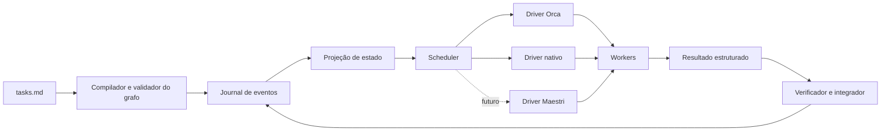

# Harness portátil de orquestração de agentes

## Protocol

- Question: Como o `my-llm-kit` deve redesenhar os harnesses de `spec`, `impl` e pesquisa para executar trabalhos grandes como um grafo observável e retomável pelo Orca hoje, sem tornar o Orca obrigatório e deixando uma fronteira estável para o Maestri no futuro?
- Decision criterion: Recomendar a menor arquitetura que mantenha tarefas e evidências fora do contexto de qualquer modelo, exponha progresso, evite escritas concorrentes inseguras, sobreviva à perda de contexto do coordenador e funcione com Orca ou execução local.
- Falsifier: Rejeitar a proposta se o Orca for necessário para a correção, se a atividade dos workers ficar invisível, se o harness duplicar a lógica nativa de cada provedor ou se uma execução grande não puder ser retomada apenas a partir do repositório.
- Risk: material

## Provider trail

| Intent | Provider | Tool or endpoint | Outcome | Fallback reason |
|---|---|---|---|---|
| Inspecionar o harness atual | Repositório local | Leitura direta de `spec`, `impl`, schemas, scripts e histórico Git | Aceito como evidência primária do estado local | Nenhum |
| Inspecionar o contrato instalado do Orca | Runtime local do Orca | Guias versionados do CLI, comandos de status, repositório, worktree, terminal e orchestration | Aceito como evidência primária local | Nenhum |
| Validar o fluxo real do Orca | Runtime local do Orca | Run, Task, terminal, Dispatch, leitura e encerramento | Parcial: Dispatch funcionou pelo caminho de baixo nível; o caminho composto e a leitura supervisionada falharam nesta instalação | Falhas `selector_not_found` e `dispatch_not_found`; observação local, não generalizada |
| Descobrir documentação do Orca | Pesquisa web | Busca nativa e documentação oficial | Aceito | A busca local não fornecia uma URL pública |
| Descobrir documentação do Codex | ScrapingDog Google endpoint | Consulta dedicada | Aceito | Nenhum |
| Coletar fontes em worker Orca | ScrapingDog, Firecrawl e busca nativa | Tentativa delegada, com resultado intermediário recuperado | Limitado: DNS falhou no worker, Firecrawl não estava disponível e o reporte de conclusão ao Orca falhou | O coordenador reabriu e adjudicou todas as fontes usadas |
| Verificar padrões do Codex | Documentação oficial da OpenAI | Páginas de subagentes, long-horizon e worktrees | Aceito | Nenhum |
| Verificar padrões do Claude | Índice estruturado `llms.txt` e documentação oficial da Anthropic | Agent teams, workflows e worktrees | Aceito | Nenhum |
| Verificar persistência de grafos | Índice estruturado `llms.txt` e documentação oficial do LangGraph | Página de persistence | Aceito como padrão arquitetural, não como dependência recomendada | Nenhum |

## Claim ledger

| Claim | Source | Accessed | Primary | Direct | Current | Independent | Verdict |
|---|---|---|---|---|---|---|---|
| O estado atual do `impl` é retomável e atômico, mas representa uma lista plana de tarefas, sem dependências, tentativas externas ou journal de eventos. | https://github.com/badmuriss/my-llm-kit | 2026-08-20 | yes | yes | yes | no | accepted |
| O Codex torna threads de subagentes visíveis e identifica poluição de contexto como uma razão para delegar, ao mesmo tempo que alerta para conflitos em trabalho paralelo com escrita. | https://learn.chatgpt.com/docs/codex/agent-configuration/subagents | 2026-08-20 | yes | yes | yes | no | accepted |
| Para trabalhos longos, a OpenAI recomenda estado durável no repositório, marcos verificáveis e um log vivo de progresso, em vez de depender apenas do contexto da conversa. | https://developers.openai.com/blog/run-long-horizon-tasks-with-codex | 2026-08-20 | yes | yes | yes | no | accepted |
| Worktrees isolam arquivos e branches de sessões paralelas, mas não substituem dependências, verificação ou integração. | https://developers.openai.com/codex/environments/git-worktrees | 2026-08-20 | yes | yes | yes | partial | accepted |
| Agent teams do Claude mantêm contextos separados, tarefas compartilhadas e dependências, mas a funcionalidade é experimental e documenta limitações de retomada e atualização de estado. | https://code.claude.com/docs/en/agent-teams | 2026-08-20 | yes | yes | yes | no | volatile |
| Workflows do Claude mantêm o plano no runtime, guardam resultados intermediários fora da conversa e apresentam progresso dos agentes. | https://code.claude.com/docs/en/workflows | 2026-08-20 | yes | yes | yes | no | accepted |
| Checkpoints de grafo e dados compartilhados entre threads são responsabilidades distintas no modelo de persistência do LangGraph. | https://docs.langchain.com/oss/python/langgraph/persistence | 2026-08-20 | yes | yes | yes | no | accepted |
| O Orca expõe Run, Task, dependências, Dispatch, workers supervisionados, mensagens e inspeção, mas deixa escalonamento e conflitos sob responsabilidade do coordenador. | https://github.com/stablyai/orca/blob/main/skill-guides/orchestration.md | 2026-08-20 | yes | yes | yes | no | accepted |
| Nesta instalação, o caminho composto `worker-start` não resolveu o worktree e o caminho de baixo nível exigiu reconciliação manual; isso demonstra a necessidade de preflight e fallback explícito, não uma falha geral do Orca. | https://github.com/stablyai/orca/blob/main/skill-guides/orchestration.md | 2026-08-20 | partial | yes | yes | no | limited |

## Findings

### Diagnóstico

O problema não é simplesmente “Codex lida pior com subagentes”. O harness mistura três responsabilidades dentro da mesma sessão:

- decidir quais tarefas estão prontas;
- transportar prompts e resultados entre agentes;
- integrar mudanças e julgar evidências.

Em uma spec grande, o coordenador acumula descrições, terminais, respostas, diffs e resultados de checks. Mesmo quando um subagente tem contexto separado, o retorno bruto volta a ocupar a sessão principal. A documentação do Codex chama esse efeito de poluição ou degradação de contexto e recomenda mover trabalho ruidoso para threads separadas, com cautela para escritas paralelas ([OpenAI, accessed 2026-08-20](https://learn.chatgpt.com/docs/codex/agent-configuration/subagents)). A orientação para trabalhos longos complementa isso: a memória operacional deve existir em arquivos duráveis, incluindo plano, marcos e status vivo ([OpenAI, accessed 2026-08-20](https://developers.openai.com/blog/run-long-horizon-tasks-with-codex)).

O `my-llm-kit` já possui uma base útil: IDs estáveis, checks por tarefa, escrita atômica e retomada de tarefas interrompidas. A lacuna é que o estado ainda é uma lista plana. Ele não sabe por que uma tarefa está pronta, qual tentativa externa a executa, que arquivos podem conflitar nem quais eventos produziram o estado atual.

### Decisão arquitetural

A fonte de verdade deve ser um protocolo portátil do próprio `my-llm-kit`. Orca deve ser o driver preferencial quando estiver disponível. Uma execução nativa deve implementar o mesmo protocolo sem Orca. Maestri poderá implementar esse contrato no futuro sem alterar `spec`, `impl` ou pesquisa.



O grafo deve coordenar trabalho, mas não virar um framework distribuído genérico. LangGraph mostra uma separação útil entre checkpoints do fluxo e dados compartilhados entre threads ([LangGraph, accessed 2026-08-20](https://docs.langchain.com/oss/python/langgraph/persistence)); isso é uma referência de design, não uma justificativa para adicionar LangGraph ou Temporal ao kit.

### Contrato mínimo do grafo

Cada tarefa de `tasks.md` deve continuar legível por humanos e ganhar campos que o harness consiga validar:

```md
### TASK-API-01: Implementar endpoint
Depends: [TASK-DOMAIN-01]
Paths: [src/api/**, src/api.test.ts]
Mode: write
Isolation: auto
Acceptance: ...
Check: npm test -- src/api.test.ts
```

O compilador deve rejeitar dependências desconhecidas, ciclos, campos ambíguos e tarefas de escrita sem escopo de paths. `Isolation: auto` significa que o scheduler escolhe o worktree conforme conflito real. `shared` e `worktree` podem existir como exceções explícitas, não como padrão aplicado a tudo.

O desbloqueio precisa depender de evidência aprovada pelo integrador. `worker_done`, término do processo ou retorno textual significam apenas que o worker reportou. Eles não tornam a tarefa `pass`.

### Estado durável

O formato recomendado tem duas camadas:

- `events.jsonl`, append-only, registra início, despacho, reporte, check, julgamento, pergunta, resposta, liberação e conclusão;
- `state.json`, projeção reconstruível usada para status rápido e retomada.

O estado deve guardar, por tentativa, o driver, IDs externos, worktree, terminal, timestamps, artefatos e último cursor lido. Para Orca, os IDs externos incluem Run, Task, Dispatch, terminal e worktree. O texto completo do terminal não deve ser copiado para o contexto do coordenador por padrão. O integrador recebe um resultado pequeno e estruturado, mais caminhos para diff e evidências.

Um resultado de worker deve conter pelo menos:

```json
{
  "task_id": "TASK-API-01",
  "outcome": "reported",
  "summary": "Implementação concluída; validação focada passou.",
  "files_changed": ["src/api/handler.ts"],
  "checks_run": ["npm test -- src/api.test.ts"],
  "evidence_refs": ["artifacts/TASK-API-01/check.txt"],
  "questions": [],
  "external_refs": {}
}
```

### Scheduler e isolamento

O scheduler deve aplicar regras simples e determinísticas:

- uma tarefa só fica pronta quando todas as dependências têm evidência `pass`;
- tarefas somente leitura podem compartilhar o worktree atual;
- tarefas de escrita podem rodar juntas apenas quando seus `Paths` não se sobrepõem;
- tarefas com sobreposição, dependência forte ou edição do mesmo arquivo são serializadas;
- worktree novo é usado para isolamento necessário, não como substituto para modelar dependências.

Worktrees oferecem isolamento de arquivos e branches ([OpenAI, accessed 2026-08-20](https://developers.openai.com/codex/environments/git-worktrees)), mas dois branches ainda podem produzir mudanças semanticamente incompatíveis. O grafo deve controlar o momento da integração e executar o check após aplicar a mudança ao estado integrado.

### Drivers

O contrato interno do driver pode ser pequeno: `detect`, `start_run`, `dispatch`, `poll`, `message`, `release` e `reconcile`.

O driver Orca deve mapear a execução para Run, Task e Dispatch, usar `worker-start` como caminho normal e registrar qualquer queda para terminal mais `dispatch --inject`. A documentação oficial deixa claro que o Orca rastreia essas entidades, mas não escolhe concorrência nem resolve conflitos pelo coordenador ([Orca, accessed 2026-08-20](https://github.com/stablyai/orca/blob/main/skill-guides/orchestration.md)). O teste local encontrou uma falha de seletor no caminho composto e uma leitura supervisionada sem agente reconhecido no caminho de baixo nível. É uma amostra fraca de uma instalação, mas suficiente para exigir preflight, reconciliação e erro visível.

O driver nativo deve reutilizar subagentes do host quando essa capacidade existir. Sem isso, pode iniciar CLIs locais ou permitir execução manual, sempre escrevendo no mesmo journal. A interface visível pode ser `harness status --watch`, mostrando tarefa, dependências, tentativa, worker, estado da evidência e bloqueio. A troca automática de Orca para nativo nunca deve ser silenciosa.

O driver Maestri deve ser adicionado somente quando houver um contrato verificável. Não foi encontrada nem assumida uma API atual do Maestri nesta pesquisa.

### Aplicação nos harnesses

- `spec` produz e valida o grafo. Não abre workers.
- `impl` inicia ou retoma o run, despacha tarefas prontas, integra resultados e julga checks.
- `research` usa o mesmo scheduler com `Mode: read` por padrão. Coletores entregam artefatos de fontes; o pesquisador principal continua responsável pela adjudicação e pelo claim ledger.

Isso evita manter três implementações diferentes de orquestração. Também reduz a dependência dos mecanismos próprios do Codex ou Claude. O Claude já oferece equipes com tarefas e dependências, mas a própria documentação marca a função como experimental e lista limitações de retomada e sincronização ([Anthropic, accessed 2026-08-20](https://code.claude.com/docs/en/agent-teams)). Workflows do Claude também demonstram a vantagem de manter plano e intermediários fora da conversa ([Anthropic, accessed 2026-08-20](https://code.claude.com/docs/en/workflows)). Esses recursos podem ser usados pelo driver, sem virar o estado canônico.

### Corte de implementação recomendado

O primeiro corte funcional deve entregar o núcleo portátil junto de dois drivers: Orca e nativo. Ele inclui parser e validador do grafo, journal, projeção, status, schema de resultado e reconciliação. Em seguida, `impl` adota esse núcleo; pesquisa adota apenas depois que a execução de implementação estiver comprovada. O Maestri entra posteriormente pelo contrato de driver.

Arquivos prováveis para uma spec de implementação:

- `skills/spec/SKILL.md` e `commands/spec.md`;
- `skills/impl/SKILL.md` e `commands/impl.md`;
- `skills/research/SKILL.md`;
- `skills/impl/scripts/impl_state.py` e `skills/impl/references/impl-state.schema.json`;
- um novo núcleo compartilhado em `skills/orchestration/`, com scripts, schemas e adapters.

O novo núcleo compartilhado é justificado porque `impl` e pesquisa precisam das mesmas garantias. Fora isso, a proposta evita dependências novas e abstrações de workflow que o MVP ainda não exige.

## Disagreements

Não houve desacordo factual relevante entre as fontes. Há uma diferença de escopo: Codex e Claude documentam mecanismos nativos de subagentes; Orca documenta coordenação externa por Run, Task e Dispatch; LangGraph documenta persistência de estado de grafos. A síntese não escolhe um deles como fonte de verdade. Ela mantém o estado no harness e usa cada produto como executor.

## Open questions

- O contrato público do Maestri ainda precisa ser verificado antes de criar o adapter.
- A spec de implementação deve decidir se o estado atual de `impl_state.py` evolui no lugar ou se o novo runner assume um diretório próprio. Para este MVP, evoluir o estado atual reduz duplicação, desde que o journal possa reconstruir a projeção.
- O Orca local precisa de um teste focado para explicar por que `worker-start --worktree current` não resolveu o worktree registrado, sem tratar o comportamento observado como universal.

## Council review

- Status: not run
- Reason: As afirmações materiais foram verificadas em documentação primária e no repositório; não houve desacordo credível, fonte primária ausente para uma conclusão publicada ou pedido de `--council`.
- Accepted findings: None.
- Rejected findings: None.

## Sources consulted

- [Repositório `my-llm-kit`](https://github.com/badmuriss/my-llm-kit), accessed 2026-08-20.
- [Codex subagents](https://learn.chatgpt.com/docs/codex/agent-configuration/subagents), accessed 2026-08-20.
- [Run long-horizon tasks with Codex](https://developers.openai.com/blog/run-long-horizon-tasks-with-codex), accessed 2026-08-20.
- [Codex git worktrees](https://developers.openai.com/codex/environments/git-worktrees), accessed 2026-08-20.
- [Claude Code agent teams](https://code.claude.com/docs/en/agent-teams), accessed 2026-08-20.
- [Claude Code workflows](https://code.claude.com/docs/en/workflows), accessed 2026-08-20.
- [Claude Code worktrees](https://code.claude.com/docs/en/worktrees), accessed 2026-08-20.
- [LangGraph persistence](https://docs.langchain.com/oss/python/langgraph/persistence), accessed 2026-08-20.
- [Orca orchestration guide](https://github.com/stablyai/orca/blob/main/skill-guides/orchestration.md), accessed 2026-08-20.
- [Orca CLI overview](https://www.onorca.dev/docs/cli/overview), accessed 2026-08-20.

## Trial by fire

- Primary-source claims: Todas as conclusões publicadas foram ancoradas no repositório, em documentação oficial de produto ou no guia oficial do Orca.
- Secondary-only claims: Nenhuma.
- Volatile claims: Agent teams do Claude permanece experimental conforme a documentação acessada em 2026-08-20; o adapter não deve depender dessa função para correção.
- Weak sample: A falha do fluxo Orca foi observada em uma instalação e uma execução. Ela sustenta preflight e reconciliação, não uma conclusão sobre confiabilidade geral do produto.
- Falsifier result: A arquitetura proposta continua correta sem Orca, expõe atividade por estado local e mantém retomada no repositório. O falsificador não foi acionado.
