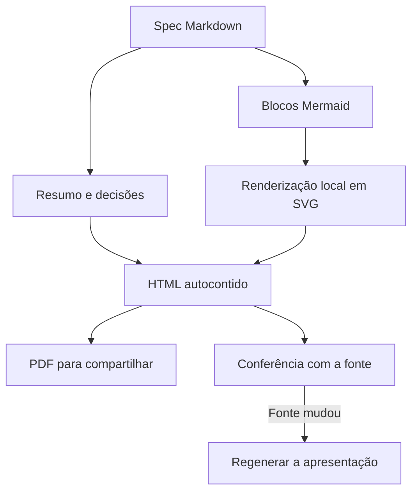
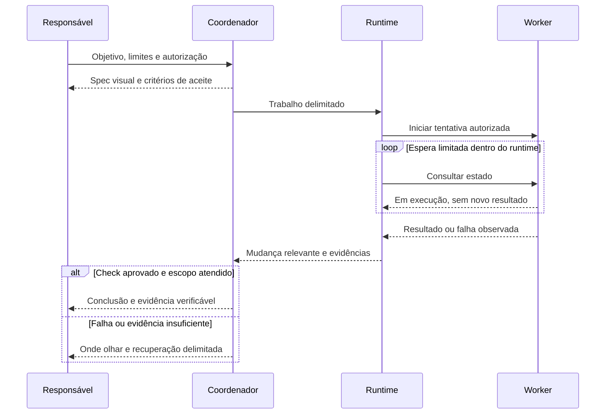

# Spec: a change the owner can understand

This is a planning example, not a report of implemented behavior. Keep the
visual-brief block and Mermaid fences in the existing canonical decision/spec.
Do not maintain a second JSON document or an independently edited PDF.

```visual-brief
{
  "schema_version": 1,
  "language": "pt-BR",
  "title": "Menos supervisão mecânica. Mais clareza para decidir.",
  "summary": "Proposta de fluxo para o my-llm-kit: tornar a mudança compreensível antes do código e deixar explícito como investigar falhas depois.",
  "before": "Um plano técnico pode esconder o que muda, quais escolhas importam e onde olhar quando a execução falha. Consultas repetidas ao coordenador também podem aumentar o custo.",
  "after": "A mesma spec gera uma visão visual com Mermaid. Rotinas mecânicas ficam no código, e o modelo retorna quando existe algo novo para avaliar. HTML e PDF apresentam a mesma fonte.",
  "flow": [
    {"title": "Entender a mudança", "detail": "Objetivo, antes/depois, limites e dúvidas que realmente alteram o plano."},
    {"title": "Revisar a decisão", "detail": "Mostrar escolhas, alternativas e critérios de aceite antes de implementar; respeitar a autorização já dada."},
    {"title": "Executar com escopo", "detail": "Usar um agente para trabalho coeso; delegar somente pacotes independentes e justificáveis."},
    {"title": "Observar e verificar", "detail": "Checks e evidências devem distinguir resultado observado, falha e informação indisponível."},
    {"title": "Explicar a conclusão", "detail": "Comparar o resultado com a spec e apontar o que não foi verificado, sem transformar aparência em aprovação."}
  ],
  "checks": [
    {"criterion": "O plano pode ser compreendido", "evidence": "Objetivo, fluxo, decisões, limites e critérios visíveis sem exigir a leitura de logs."},
    {"criterion": "A apresentação corresponde à fonte", "evidence": "Verificação da spec, dos SVGs e do HTML. Mudanças exigem regeneração."},
    {"criterion": "As falhas têm um caminho de investigação", "evidence": "Cada risco aponta um sintoma, onde buscar evidência e como recuperar sem esconder incerteza."}
  ],
  "risks": [
    {"symptom": "O worker não terminou", "inspect": "Estado da tentativa, timeout e identificação do responsável; silêncio não prova falha.", "recovery": "Verificar o estado antes de cancelar ou substituir; manter as obrigações de cleanup."},
    {"symptom": "O teste falhou", "inspect": "Check exato, versão dos arquivos e evidência produzida; separar defeito de erro do ambiente.", "recovery": "Corrigir uma hipótese delimitada. Não aumentar reasoning ou abrir novos agentes automaticamente."},
    {"symptom": "O diagrama está bonito, mas desatualizado", "inspect": "Fingerprint da spec e revisão do código referenciada.", "recovery": "Regenerar a visão a partir da fonte; não editar o PDF como se fosse o plano original."}
  ],
  "decisions": [
    "HTML é a visão principal. PDF é uma exportação da mesma visão, incluindo os diagramas.",
    "Mermaid explica relações e sequências. As setas do processo não representam a arquitetura inteira do software.",
    "Os SVGs são renderizados localmente uma vez. Abrir ou verificar o HTML não chama outro modelo nem carrega uma CDN."
  ],
  "excluded": [
    "Ativar modelos, MCPs ou serviços externos automaticamente.",
    "Transformar todo ajuste trivial em um documento formal.",
    "Apresentar esta proposta como dashboard ao vivo ou evidência de execução."
  ]
}
```

## Da especificação aos documentos



## Coordenação e diagnóstico


